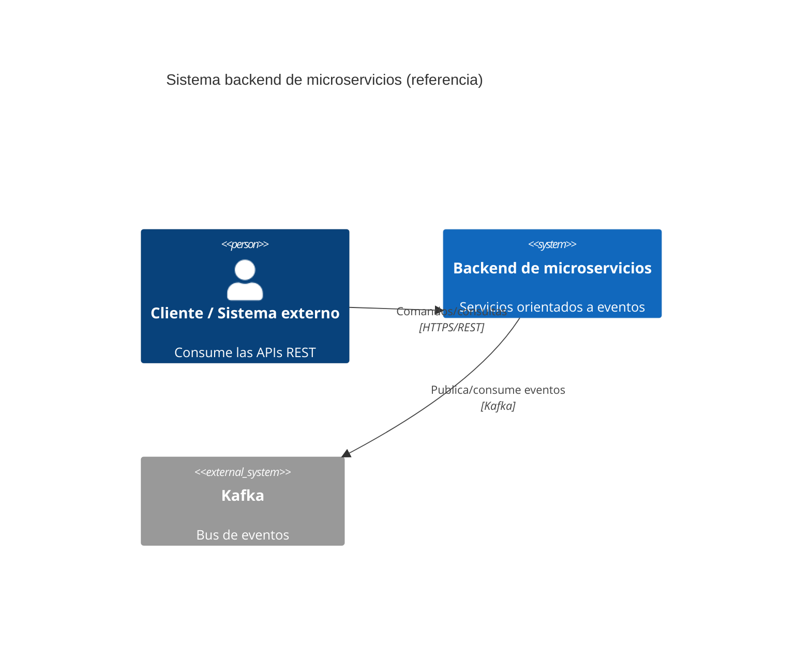
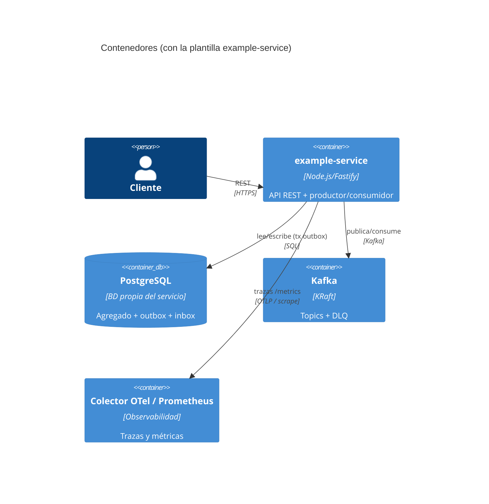
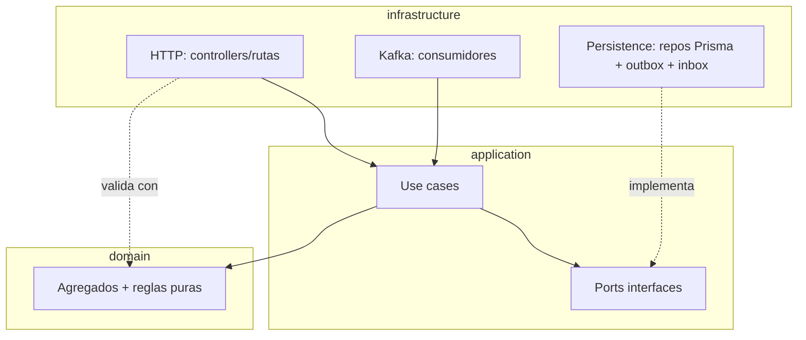

# Diagramas (modelo C4)

Diagramas en Mermaid, versionados con el código. Renderizan en GitHub.

## Nivel 1 — Contexto

## Nivel 2 — Contenedores

## Nivel 3 — Componentes (clean architecture de un servicio)

Regla de dependencias: `infrastructure → application → domain`. El dominio no
importa infraestructura (se hace cumplir por ESLint).
